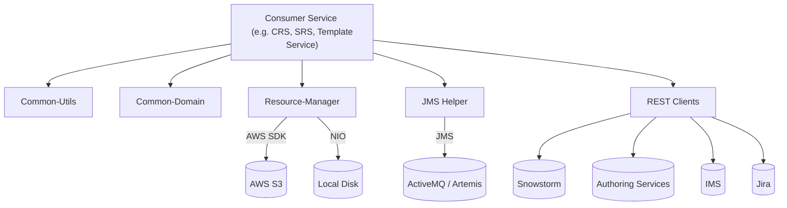
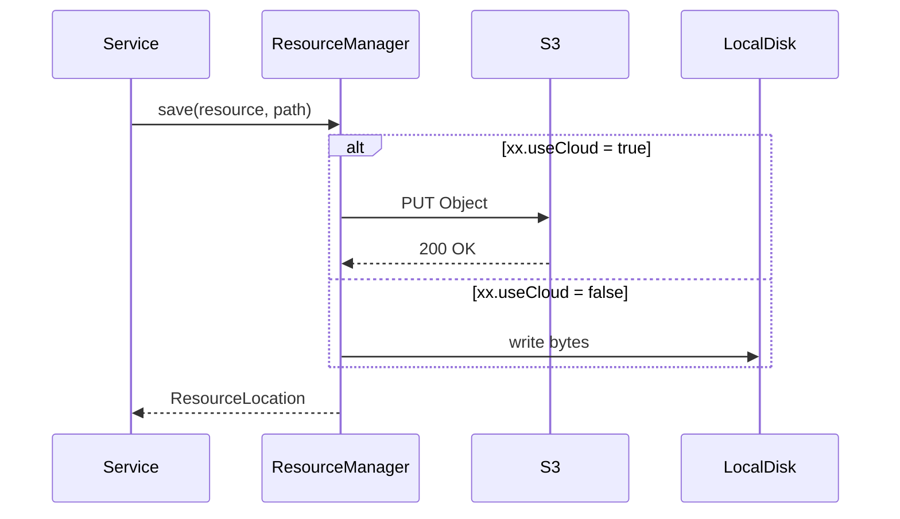

# OTF-Common Libraries (OC)

The **Open Tooling Framework Common** project is a set of Spring-friendly Java libraries that provide shared domain models, utilities, and infrastructure building blocks for SNOMED International applications.

OTF-Common is consumed by multiple services (Snowstorm, CRS, Template Service, Authoring Platform etc.) to avoid code duplication and establish consistent engineering patterns across the organisation.  The project is published to the internal Maven repository as separate artefacts but is developed in a single multi-module repository.

This document describes **how to build and use OTF-Common locally** as well as the **conventions and best practices** to follow when contributing to the code-base.

---

## 1  High-Level Architecture



Key points:
* OTF-Common is **stateless** – no runtime state is held inside the libraries.
* The **Resource Manager** offers a pluggable storage facade that can switch between local disk and AWS S3 by configuration.
* The **JMS Helper** wraps common ActiveMQ/Jakarta JMS boiler-plate and promotes idempotent message handling.
* **Domain** and **REST** modules expose POJOs for Snowstorm, Authoring Services, Jira and more, enabling strong typing across services.

---

## 2  Module Highlights

* **Resource Manager**  – storage abstraction with seamless switching between local file-system and AWS S3  
  * Core – `org.ihtsdo.otf.resourcemanager.ResourceManager`  
  * Auto-configuration – `ResourceConfiguration` (creates beans from Spring properties)  
  * Offline S3 stub for unit tests – `OfflineS3ClientImpl`
* **Common Domain** – 150+ immutable POJOs that mirror Snowstorm’s REST API payloads (Concepts, Refset Members, Projects, etc.)
* **Common Utils** – thin layer of frequently used helpers (`IOUtils`, `JsonUtils`, etc.)
* **REST Client Helpers**  
  * Expressive error handling (`ExpressiveErrorHandler`)  
  * Lightweight Resty wrapper (`RestyServiceHelper`)
* **JMS Helper** – `MessagingHelper` simplifies JSON/Java Message handling and standardises header usage.
* **S3 DAO** – typed DAO over AWS S3 with retry logic (`S3ClientImpl`, `S3ClientFactory`).
* **Google Sheets support** – convenience wrappers around the Google Sheets & Drive APIs.

---

## 3  Project Layout

```
otf-common-parent/
  pom.xml                     ← aggregator & shared build config
  otf-common/                 ← core components (REST, JMS, S3 DAO, constants)
  resource-manager/           ← pluggable storage layer
  common-utils/               ← low-level utilities
  common-domain/              ← shared domain objects
```

Package conventions:
* `org.ihtsdo.otf.constants`        Shared constants and enumerations.  
* `org.ihtsdo.otf.dao.s3`           S3 DAO & helpers.  
* `org.ihtsdo.otf.rest.client`      REST client helpers and adapters.  
* `org.ihtsdo.otf.jms`              JMS convenience utilities.  
* `org.ihtsdo.otf.resourcemanager`  Storage abstraction.

---

## 4  Getting Started Locally

### 4.1  Prerequisites

1. **JDK 17** (aligned with the parent BOM).  
2. **Maven 3.8+** (wrapper included).  
3. (Optional) **Docker** if you want to run LocalStack for S3 integration tests.

### 4.2  Clone & Build

```bash
git clone https://github.com/IHTSDO/OTF-Common.git
cd OTF-Common
./mvnw clean install -DskipITs       # unit tests only
./mvnw clean verify                  # full build incl. integration tests
```

A successful build installs the following artefacts to your local Maven cache:

```
org.ihtsdo.otf.common:otf-common-parent:${VERSION}
org.ihtsdo.otf.common:otf-common:${VERSION}
org.ihtsdo.otf.common:resource-manager:${VERSION}
org.ihtsdo.otf.common:common-domain:${VERSION}
org.ihtsdo.otf.common:common-utils:${VERSION}
```

### 4.3  Using the Libraries in Your Project

Add the desired dependency to your `pom.xml` (parent BOM import omitted for brevity):

```xml
<dependency>
  <groupId>org.ihtsdo.otf.common</groupId>
  <artifactId>otf-common</artifactId>
  <version>${otf-common.version}</version>
</dependency>
```

### 4.4  Resource Manager Configuration

Create Spring properties (replace `xx` with a meaningful namespace, e.g. `srs.build.storage`).

```properties
# Use AWS S3 or local disk
xx.useCloud=false

# Open the store in read-only or read/write mode
xx.readonly=false

# Local disk root folder (effective when useCloud=false)
xx.local.path=/data/store/builds

# AWS S3 bucket & prefix (effective when useCloud=true)
xx.cloud.bucketName=my-build-bucket
xx.cloud.path=store/builds
```

---

## 5  Storage & Messaging Details

### 5.1  Resource Manager Flow



* ResourceManager is thread-safe and idempotent – repeated writes of the same resource are noop.
* Integration tests mock S3 via **LocalStack** (`testcontainers`).

### 5.2  JMS Helper

* Standardises headers `application`, `eventType`, `correlationId`.
* Ensures safe JSON serialisation with **Jackson**.
* Consumers **must** be idempotent – messages may be redelivered.

---